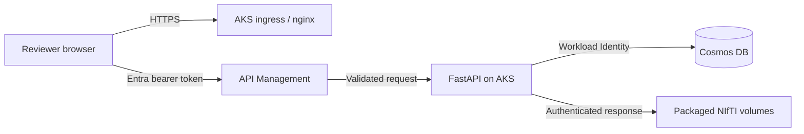

# SegMed ICH Progression Review

This application presents 50 paired head CT studies for reviewing
report-derived intracranial hemorrhage progression candidates. It preserves the
Niivue comparison, navigation, windowing, patient timeline, scoring, notes, and
sorting behavior from the `rsna2026-reimagined-data-candidates` viewer while
hosting it on the existing Entra, APIM, AKS, and Cosmos stack.

The candidates are for research review and are not clinical ground truth.

## Architecture



- `frontend`: Vite, TypeScript, MSAL, Niivue, and the source viewer UI
- `backend`: FastAPI, Entra token validation, per-user reviews, and protected
  manifest/volume delivery
- `backend/data/manifest.json`: the committed 50-case source manifest
- `tools/prepare_volumes.py`: downloads the 98 generated NIfTI files required by
  the viewer
- `_infra` and `k8s`: APIM, AKS, Cosmos DB, ingress, and workload identity

## User Authorization

Every production API request is validated first by APIM and again by FastAPI.
FastAPI derives the reviewer identity exclusively from the access token's
immutable tenant ID (`tid`) and object ID (`oid`). A client can submit only a
score and note; it cannot select or spoof a reviewer.

Each reviewer can read and modify only their own scores, notes, and sort
preference. Two people reviewing the same case therefore create independent
records, even when they use the same workstation. Display names and email
addresses are not used as record keys.

Users must exist in the Entra tenant that owns the app registration. External
reviewers can be invited as B2B guests. Tenant/app assignment policy controls
who may obtain an access token; the API controls which review records that
identity may access.

## Entra Setup

Create or use one Entra app registration for the SPA and delegated API:

1. Add a **Single-page application** platform.
2. Add `http://localhost:5173` as a local redirect URI.
3. Expose Application ID URI `api://<client-id>`.
4. Add delegated scope `access_as_user` and grant the required consent.
5. Configure access tokens as version 2 when required by the tenant.
6. After provisioning, add the HTTPS value from `azd env get-value FRONTEND_URL`
   as another SPA redirect URI.

## Imaging Data

The source repository commits the manifest but intentionally excludes the
NIfTI data. The viewer needs 98 files totaling approximately 0.92 GiB from
storage account `ctdatancus`, container `segmed`.

The signed-in Azure CLI user needs **Storage Blob Data Reader** on that source
storage account. Check access and prepare the exact blobs referenced by the
manifest:

```powershell
$sourceTenant = '72f988bf-86f1-41af-91ab-2d7cd011db47'
.\.venv\Scripts\python tools\prepare_volumes.py --tenant-id $sourceTenant --check-access
.\.venv\Scripts\python tools\prepare_volumes.py --tenant-id $sourceTenant
```

Downloads are size-validated, resumable by re-running the command, and written
to `backend/data/volumes/`. That directory is ignored by Git but intentionally
included in the backend Docker build context. `--plan` reports what is missing
without authenticating or downloading.

## Local Development

Prerequisites:

- Python 3.11+
- Node.js 18+
- Docker Desktop
- Azure CLI for volume preparation
- An Entra app registration configured as above

```powershell
$env:ENTRA_CLIENT_ID = '<application-client-id>'
$env:AZURE_TENANT_ID = '<tenant-id>'
docker compose up --build
```

Open [http://localhost:5173](http://localhost:5173). Local Compose uses SQLite
for reviews and runs the API in development mode; AKS always disables that
mode.

For separate frontend development, run `npm run dev` from `frontend` and open
[http://localhost:5174](http://localhost:5174).

## Azure Deployment

```powershell
azd auth login
azd env new rad
azd env set ENTRA_CLIENT_ID '<application-client-id>'
azd env set APIM_PUBLISHER_EMAIL '<operations-email>'
azd env set AZURE_LOCATION 'eastus2'
azd up
```

Prepare the NIfTI volumes before `azd up`; the post-provision hook builds the
backend image from `backend/`, including the local ignored volume directory.
The deployment provisions ACR, AKS, serverless Cosmos DB, APIM, Log Analytics,
Application Insights, workload identity, NGINX ingress, and TLS.

Useful outputs:

```powershell
azd env get-value FRONTEND_URL
azd env get-value APIM_GATEWAY_URL
```

## API

All endpoints except `/healthz` require an Entra bearer token in production.
APIM exposes the `/api` routes with `GET`, `PUT`, and `OPTIONS` only.

| Method | Path | Purpose |
|---|---|---|
| `GET` | `/healthz` | Container health check |
| `GET` | `/api/me` | Current reviewer display name |
| `GET` | `/api/manifest` | Protected 50-case manifest |
| `GET` | `/api/volumes/{case_id}/{phase}` | Protected prior/later NIfTI volume |
| `GET` | `/api/reviews` | Current reviewer's scores, notes, and preference |
| `PUT` | `/api/reviews/{case_id}` | Upsert or clear the current reviewer's score/note |
| `PUT` | `/api/preferences` | Update the current reviewer's sort order |

## Validation

```powershell
.\.venv\Scripts\python -m unittest discover -s backend\tests -p 'test_*.py' -v
.\.venv\Scripts\python -m compileall backend\src tools\prepare_volumes.py
Push-Location frontend
npm ci
npm run build
npm run lint
Pop-Location
az bicep build --file _infra\main.bicep
```

To remove Azure resources:

```powershell
azd down --purge --force
```
