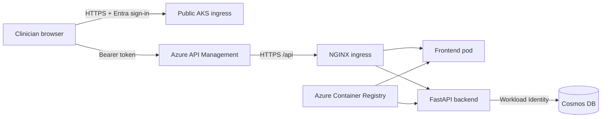

# Rad Workflow

Rad Workflow is a small, authenticated collaboration application for selecting
radiology cases with physicians. Teams can add candidate cases, move them
through review states, record include/exclude/discuss recommendations, and keep
the clinical rationale in one shared queue.

The application has exactly two runtime services:

- `frontend`: React, TypeScript, Vite, MSAL, and nginx
- `backend`: Python 3.11 and FastAPI

There is no AI runtime, GPU node pool, Foundry resource, agent identity, or
orchestrator service.

## Architecture



### Public Access

The frontend is publicly accessible over HTTPS at the `FRONTEND_URL` output
from `azd`. The post-provision hook installs an NGINX ingress controller with a
public Azure Load Balancer, assigns a deterministic
`*.cloudapp.azure.com` DNS name, and uses cert-manager with Let's Encrypt for
TLS.

Browser API calls go to the public APIM gateway, not directly to the backend.
APIM validates the Entra access token and forwards the request to `/api` on the
TLS ingress. FastAPI validates the token again. The Kubernetes `frontend` and
`backend` Services remain `ClusterIP` and are not individually public.

### Data

Azure uses one serverless Cosmos DB account, one `radiology` database, and one
`cases` container partitioned by `/case_id`. Serverless storage is usage-based
and is appropriate for the expected workload of approximately 1 GB; there is
no 1 GB reservation or minimum database throughput.

Local Docker development uses SQLite in the `radiology-data` named volume.

## Repository

```text
.
|-- _infra/                 Bicep and azd provisioning hooks
|-- backend/                FastAPI API and Docker image
|   `-- src/
|       |-- auth_middleware.py
|       `-- radiology_api.py
|-- frontend/               React/Vite SPA and nginx image
|-- k8s/app.yaml            Frontend/backend AKS resources and public ingress
|-- azure.yaml              Azure Developer CLI project
`-- docker-compose.yml      Local two-service stack
```

## Entra Setup

Create a Microsoft Entra app registration for the SPA/API before running the
application:

1. Add a **Single-page application** platform.
2. Add `http://localhost:5173` as a local redirect URI.
3. Expose an API with Application ID URI `api://<client-id>`.
4. Add a delegated scope named `access_as_user`.
5. Allow users in the tenant to consent to that scope, or grant admin consent.
6. Set access token version `2` in the app manifest when required by the tenant.

Azure derives the production hostname during provisioning. After the first
provision, obtain it with:

```powershell
azd env get-value FRONTEND_URL
```

Add that HTTPS URL to the app registration's SPA redirect URIs. Rerun `azd up`
after changing the registration so the frontend image and deployment use the
final URL.

## Local Development

Prerequisites:

- Docker Desktop
- An Entra app registration configured as described above

In PowerShell:

```powershell
$env:ENTRA_CLIENT_ID = '<application-client-id>'
$env:AZURE_TENANT_ID = '<tenant-id>'
docker compose up --build
```

Open [http://localhost:5173](http://localhost:5173). The backend is also
available at [http://localhost:8000](http://localhost:8000). Compose runs the
backend with `DEVELOPMENT_MODE=true` and SQLite; production never enables that
mode.

To stop the stack:

```powershell
docker compose down
```

Use `docker compose down --volumes` only when the local case database should be
deleted.

## Azure Deployment

Prerequisites:

- Azure CLI
- Azure Developer CLI (`azd`)
- `kubectl`
- Helm 3
- An Azure subscription where you can create role assignments

Configure and deploy:

```powershell
azd auth login
azd env new rad-dev
azd env set ENTRA_CLIENT_ID '<application-client-id>'
azd env set APIM_PUBLISHER_EMAIL '<operations-email>'
azd env set AZURE_LOCATION 'eastus2'
azd up
```

`azd up` performs the following work:

1. Provisions ACR, one CPU-only AKS cluster, serverless Cosmos DB, APIM, Log
   Analytics, Application Insights, and a standard backend workload identity.
2. Builds only `backend:latest` and `frontend:latest` in ACR.
3. Installs NGINX ingress and cert-manager in AKS.
4. Applies [k8s/app.yaml](k8s/app.yaml) with the provisioned values.
5. Waits for both application deployments to roll out.

Useful outputs:

```powershell
azd env get-value FRONTEND_URL
azd env get-value APIM_GATEWAY_URL
azd env get-value COSMOS_ENDPOINT
```

Certificate issuance and public DNS propagation can take several minutes after
the first deployment.

### Optional Sizing

The default AKS node is `Standard_D2s_v5` with one node and no GPU. Override it
before deployment when needed:

```powershell
azd env set AKS_NODE_VM_SIZE 'Standard_D2s_v5'
azd env set APIM_SKU 'Basicv2'
```

## API

All application endpoints except `/healthz` require an Entra bearer token in
production.

| Method | Path | Purpose |
|---|---|---|
| `GET` | `/healthz` | Container health check |
| `GET` | `/api/me` | Current clinician display name |
| `GET` | `/api/cases` | List and filter cases |
| `POST` | `/api/cases` | Add a candidate case |
| `GET` | `/api/cases/{case_id}` | Read one case |
| `PATCH` | `/api/cases/{case_id}` | Change status, priority, or assignment |
| `GET` | `/api/cases/{case_id}/reviews` | List clinical review notes |
| `POST` | `/api/cases/{case_id}/reviews` | Add a recommendation and note |
| `GET` | `/api/dashboard` | Queue counts |

Use a non-identifying value for `patient_reference`; do not copy unnecessary
protected health information into collaboration notes.

## Validation

```powershell
python -m py_compile backend/src/auth_middleware.py backend/src/radiology_api.py
Push-Location frontend
npm ci
npm run build
Pop-Location
az bicep build --file _infra/main.bicep
```

To remove Azure resources:

```powershell
azd down --purge --force
```